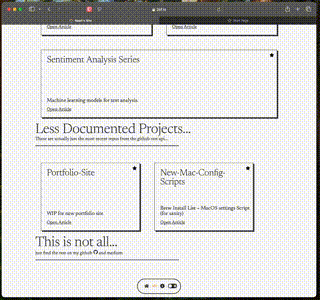
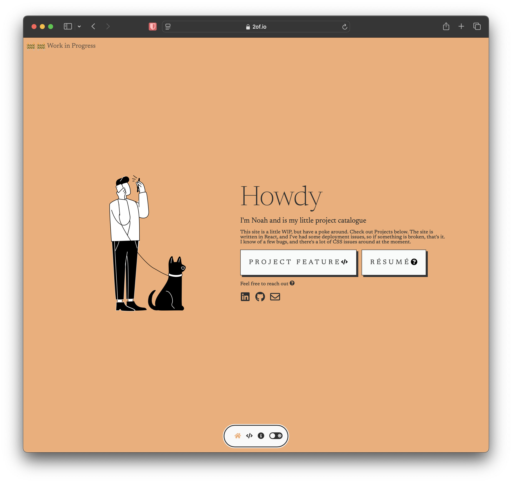
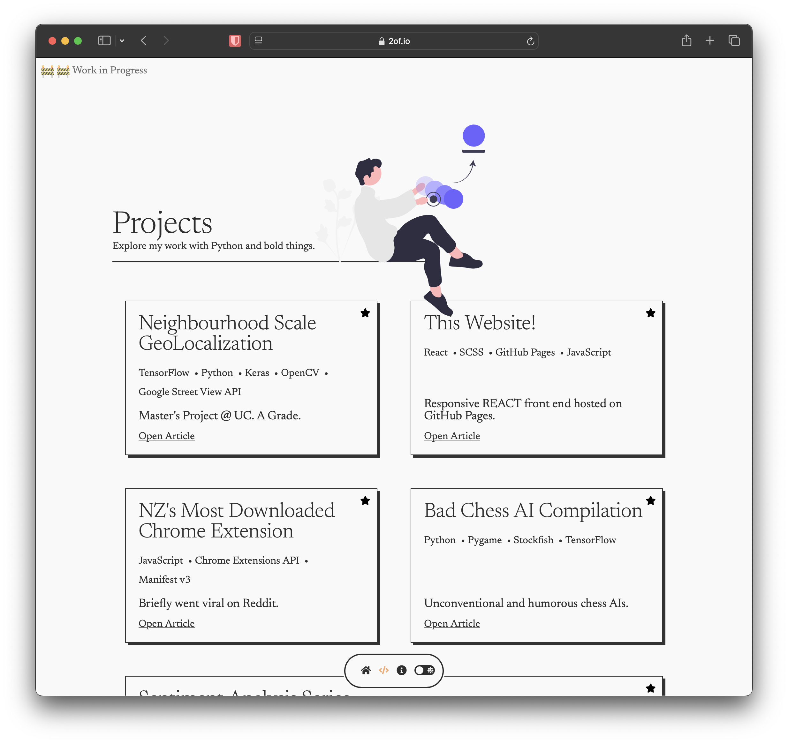
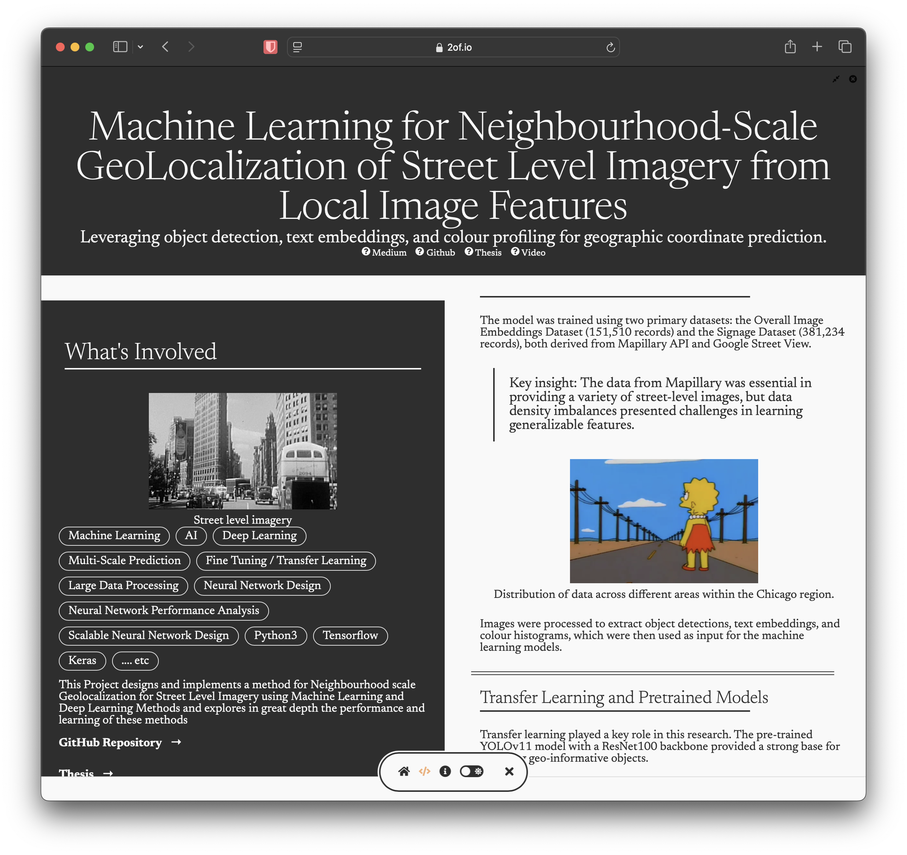

# 🚀 My Portfolio Site  

[](https://2of.github.io/Portfolio-Site/)

This is still a **work in progress**, but it's **live** on GitHub Pages! 🎉  

🔗 **Check it out here:** [2of.github.io/Portfolio-Site](https://2of.github.io/Portfolio-Site/)  

More updates coming soon! 🚧  Absolutely a WIP but it's just for exploring React really atm.

---
# It's a lot more complex than it looks.
There's a bunch of fancy contexts, react portals, providers and middleware in there. 

There's a whole markup language defined for the 'articles' in /projects (and also on the homepage)
(FYI routing not implemetned for individual projects ).


## 'Column' Objects can interpret this schema.
#### Data is therefore just popped into /src/assets (not public) gh pages is enough of a repo to not bother hosting elsewhere

best way to convert text to the schema is using an LLM

```javascript
{
    "name": "example-project",
    "title": "An Example Project Title",
    "subtitle": "A brief subtitle describing the project",
    "sections": [
      {
        "name": "Introduction",
        "type": "text",
        "items": [
          {
            "type": "paragraph",
            "text": "This is an example paragraph that introduces the project. It provides an overview of the purpose and scope."
          },
          {
            "type": "highlight",
            "text": "This section contains an important takeaway or key point."
          },
          {
            "type": "pills",
            "pills": ["Tag1", "Tag2", "Tag3", "Tag4"]
          }
        ]
      },
      {
        "name": "Methodology",
        "type": "text",
        "items": [
          {
            "type": "paragraph",
            "text": "This section explains the approach used in the project, including techniques and tools."
          },
          {
            "type": "image",
            "src": "/assets/images/example.png",
            "alt": "A descriptive caption for the image."
          }
        ]
      },
      {
        "name": "Results",
        "type": "text",
        "items": [
          {
            "type": "paragraph",
            "text": "A summary of key findings and outcomes from the project."
          }
        ]
      },
      {
        "name": "Qualifications",
        "type": "qualifications",
        "items": [
          {
            "title": "Example Degree",
            "institution": "Example University",
            "year": "202X"
          },
          {
            "title": "Another Example Certification",
            "institution": "Example Institution",
            "year": "202X"
          }
        ]
      }
    ],
    "link": {
      "text": "Read More About This Example",
      "url": "https://example.com/example-project"
    }
  }
  

```


## 📸 It's responsive, like all 2025 things  



I like the 'tiktok' view though
### Large View  
  

### Little View  
  

### Projects Page  
  


🚧 🚧 🚧 🚧 🚧 🚧 🚧 🚧 🚧 🚧 

#### Obvious WIP ahead

### Article Page  
  

---

Stay tuned for more updates! 🚀